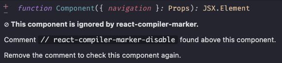

# React Compiler Marker ✨

`react-compiler-marker` is a VSCode/Cursor extension that shows which React components are optimized by the React Compiler
- ✨ = optimized
- 🚫 = failed (with tooltip explaining why)

## Features 🌟

- Markers for optimized and failed components ✨/🚫
- Hover tooltips with details
- Commands to enable/disable markers or check a single file
- Preview Compiled Output: Preview the compiled output of the current file
- Workspace scanning to find all unoptimized components across your project
- Interactive HTML report with sortable/filterable table
- Problems panel integration with inline warnings
- Status bar indicator for quick workspace access
- Ignore functionality via settings patterns or inline comments

✨ Optimized component


🚫 Failed component


⭕ Ignored component



## Available commands 🛠️

Open Command Palette (Ctrl+Shift+P / Cmd+Shift+P) and type:

### Per-File Commands
1. **Activate Extension**: Activates markers for all files in the current session
   ```bash
   React Compiler Marker: Activate Extension
   ```
2. **Deactivate Extension**: Deactivates markers and clears them from the editor
   ```bash
   React Compiler Marker: Deactivate Extension
   ```
3. **Check in the current file**: Analyzes a single file for one-time feedback
   ```bash
   React Compiler Marker: Check in the current file
   ```
4. **Preview Compiled Output**: Preview the compiled output of the current file
   ```bash
   React Compiler Marker: Preview Compiled Output
   ```

### Workspace Commands
5. **Scan Workspace**: Scans entire workspace and shows interactive report
   ```bash
   React Compiler Marker: Scan Workspace
   ```
6. **Show Problems Panel**: Scans workspace and shows results in Problems panel
   ```bash
   React Compiler Marker: Show Problems Panel
   ```
7. **Clear Problems**: Clears all warnings from Problems panel
   ```bash
   React Compiler Marker: Clear Problems
   ```

**Tip**: Click the status bar item `✨ React Compiler` for quick access to workspace scanning.

## Configuration ⚙️

### Settings

```json
{
  // Show/hide status bar indicator
  "reactCompilerMarker.showStatusBar": true,

  // File patterns to ignore during workspace scans
  "reactCompilerMarker.ignorePatterns": [
    "**/node_modules/**",
    "**/dist/**",
    "**/*.test.{ts,tsx,js,jsx}",
    "**/__tests__/**"
  ]
}
```

### Ignore Specific Components

Add a comment above any component to ignore it during workspace scans:

```tsx
// react-compiler-marker-disable
function MyLegacyComponent() {
  // This component will be ignored
}
```

## Requirements ⚙️

This extension does not require external setup or dependencies. However, to fully utilize React Compiler insights, ensure your project:
- Includes React codebases.
- Uses standard JavaScript, TypeScript, or `jsx`/`tsx` file formats.
- Has React Compiler installed

## Known Issues 🐛

- Some rare edge cases of anonymous functions could fail to properly display tooltips.
- For files with a large number of React components, performance may degrade slightly during real-time updates.

## For More Information 🤝

- Learn about [React Compiler](https://react.dev/learn/react-compiler) and how it can improve your React app's performance.
- Submit issues or contribute via the [GitHub Repository](https://github.com/blazejkustra/react-compiler-marker).

## Links

- [React Compiler Marker VSCode](https://marketplace.visualstudio.com/items?itemName=blazejkustra.react-compiler-marker)
- [React Compiler Marker Open VSX](https://open-vsx.org/extension/blazejkustra/react-compiler-marker)

**Enjoy Coding with React Compiler Marker ✨!**
