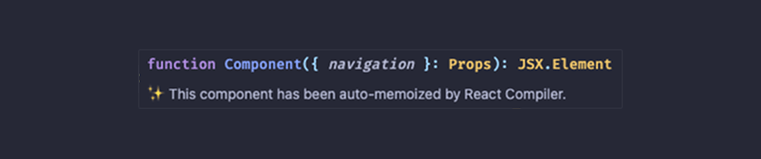
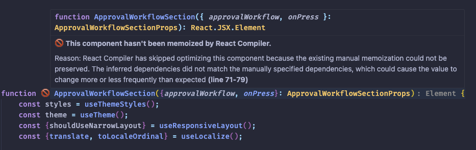

# React Compiler Marker ✨

`react-compiler-marker` highlights React components optimized by the React Compiler. This tool provides clear, visual indicators ✨ for successfully optimized components and 🚫 for those that failed optimization. It makes the optimization process more transparent and helps developers achieve better performance in their React applications.

## Features 🌟

- **Highlight Optimized Components:** Receive visual markers ✨ for React functions or components successfully optimized by the React Compiler.
- **Spot Failed Optimizations:** See clear indicators 🚫 for components that couldn't be optimized, with detailed hover tooltips explaining why.
- **Hover for Details:** Hover over markers to display the reason for optimization success or failure.
- **Manual Controls:**
  - Activate or deactivate the extension as needed.
  - Perform a one-time check of the current file using the `Check Once` command.

### Screenshots 📸
#### Example Optimized Marker ✨


#### Example Failed Marker 🚫


## Commands 🛠️
The extension provides the following commands:
1. **Activate Decorations**: Activates the markers for all relevant files in the current session.
   ```bash
   React Compiler Marker: Activate Extension
   ```
2. **Deactivate Decorations**: Deactivates the markers and clears them from the editor.
   ```bash
   React Compiler Marker: Deactivate Extension
   ```
3. **Check Once (File-Specific Check)**: Analyzes a single file for one-time feedback without altering activation state.
   ```bash
   React Compiler Marker: Check Once
   ```

These commands can be accessed via the Command Palette (`Ctrl+Shift+P` / `Cmd+Shift+P`) and are associated with customizable keyboard shortcuts in your VS Code settings.

## Requirements ⚙️

This extension is fully self-contained and does not require external setup or dependencies. However, to fully utilize React Compiler insights, ensure your project:
- Includes React codebases.
- Uses standard JavaScript, TypeScript, or `jsx`/`tsx` file formats.

## Known Issues 🐛

- Some rare edge cases of anonymous functions could fail to properly display tooltips.
- For files with a large number of React components, performance may degrade slightly during real-time updates.

## Release Notes 📜

### 1.0.0
- Initial release of React Compiler Marker ✨.
- Added support for:
  - Marking optimized (`✨`) and failed (`🚫`) components.
  - Hoverable tooltips with optimization details.
  - Commands for manual control (`Activate`, `Deactivate`, `Check Once`).

## For More Information 🤝

- Learn about [React Compiler](https://react.dev) and how it can improve your React app's performance.
- Familiarize yourself with [VS Code Extensions API](https://code.visualstudio.com/api).
- Submit issues or contribute via the [GitHub Repository](https://github.com/your-repo/react-compiler-marker).

**Enjoy Coding with React Compiler Marker ✨!**