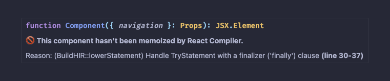

# React Compiler Marker ✨

`react-compiler-marker` is an IDE extension that shows which React components are optimized by the React Compiler. Available for VSCode/Cursor and WebStorm/IntelliJ IDEA.

## Features 🌟

- Customizable emoji markers for optimized and failed components
- Hover tooltips with details
- Commands to enable/disable markers or check a single file
- Preview Compiled Output: Preview the compiled output of the current file

✨ Optimized component


🚫 Failed component



## Available commands 🛠️

Open Command Palette (Ctrl+Shift+P / Cmd+Shift+P) and type:

1. **Activate Decorations**: Activates the markers for all relevant files in the current session.
   ```bash
   React Compiler Marker: Activate Extension
   ```
2. **Deactivate Decorations**: Deactivates the markers and clears them from the editor.
   ```bash
   React Compiler Marker: Deactivate Extension
   ```
3. **Check Once (File-Specific Check)**: Analyzes a single file for one-time feedback without altering activation state.
   ```bash
   React Compiler Marker: Check Once
   ```
4. **Preview Compiled Output**: Preview the compiled output of the current file
   ```bash
   React Compiler Marker: Preview Compiled Output
   ```

## Configuration ⚙️

You can configure the extension via VSCode/Cursor settings:

### `reactCompilerMarker.successEmoji`

Emoji marker to display next to components that were successfully memoized (Default: ✨, can be null)

```json
{
  "reactCompilerMarker.successEmoji": "✨"
}
```

### `reactCompilerMarker.errorEmoji`

Emoji marker to display next to components that failed to be memoized (Default 🚫, can be null)

```json
{
  "reactCompilerMarker.errorEmoji": "🚫"
}
```

### `reactCompilerMarker.babelPluginPath`

Path to the babel-plugin-react-compiler in your project. By default it's `node_modules/babel-plugin-react-compiler`.

```json
{
  "reactCompilerMarker.babelPluginPath": "node_modules/babel-plugin-react-compiler"
}
```

## Known Issues 🐛

- Some rare edge cases of anonymous functions could fail to properly display tooltips.
- For files with a large number of React components, performance may degrade slightly during real-time updates.

## For More Information 🤝

- Learn about [React Compiler](https://react.dev/learn/react-compiler) and how it can improve your React app's performance.
- Submit issues or contribute via the [GitHub Repository](https://github.com/blazejkustra/react-compiler-marker).

## Installation

### VS Code / Cursor

Install from:
- [VS Code Marketplace](https://marketplace.visualstudio.com/items?itemName=blazejkustra.react-compiler-marker)
- [Open VSX](https://open-vsx.org/extension/blazejkustra/react-compiler-marker)

Or search for "React Compiler Marker" in the Extensions panel.

### WebStorm / IntelliJ IDEA

The WebStorm/IntelliJ plugin is available in the `packages/webstorm-plugin` directory.

**Building from source:**

```bash
cd packages/webstorm-plugin
gradle wrapper --gradle-version 8.5
./gradlew buildPlugin
```

The plugin will be at `build/distributions/react-compiler-marker-*.zip`

**Installation:**
1. Open WebStorm/IntelliJ IDEA
2. Go to **Settings/Preferences** → **Plugins**
3. Click ⚙️ → **Install Plugin from Disk...**
4. Select the built `.zip` file
5. Restart the IDE

For more details, see [WebStorm Plugin Documentation](packages/webstorm-plugin/README.md)

## Links

- [GitHub Repository](https://github.com/blazejkustra/react-compiler-marker)
- [VS Code Marketplace](https://marketplace.visualstudio.com/items?itemName=blazejkustra.react-compiler-marker)
- [Open VSX](https://open-vsx.org/extension/blazejkustra/react-compiler-marker)

**Enjoy Coding with React Compiler Marker ✨!**
