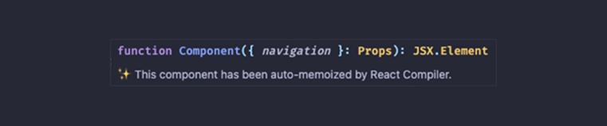

# React Compiler Marker ✨

`react-compiler-marker` is a VSCode/Cursor extension that shows which React components are optimized by the React Compiler
- ✨ = optimized
- 🚫 = failed (with tooltip explaining why)

## Features 🌟

- Markers for optimized and failed components ✨/🚫
- Hover tooltips with details 
- Commands to enable/disable markers or check a single file
- Preview Compiled Output: Preview the compiled output of the current file

✨ Optimized component



🚫 Failed component


## Available commands 🛠️

Open Command Palette (Ctrl+Shift+P / Cmd+Shift+P) and type:

1. **Activate Decorations**: Activates the markers for all relevant files in the current session.
   ```bash
   React Compiler Marker: Activate Extension
   ```
2. **Deactivate Decorations**: Deactivates the markers and clears them from the editor.
   ```bash
   React Compiler Marker: Deactivate Extension
   ```
3. **Check Once (File-Specific Check)**: Analyzes a single file for one-time feedback without altering activation state.
   ```bash
   React Compiler Marker: Check Once
   ```
4. **Preview Compiled Output**: Preview the compiled output of the current file
   ```bash
   React Compiler Marker: Preview Compiled Output
   ```

## Requirements ⚙️

This extension does not require external setup or dependencies. However, to fully utilize React Compiler insights, ensure your project:
- Includes React codebases.
- Uses standard JavaScript, TypeScript, or `jsx`/`tsx` file formats.
- Has React Compiler installed

## Known Issues 🐛

- Some rare edge cases of anonymous functions could fail to properly display tooltips.
- For files with a large number of React components, performance may degrade slightly during real-time updates.

## For More Information 🤝

- Learn about [React Compiler](https://react.dev/learn/react-compiler) and how it can improve your React app's performance.
- Submit issues or contribute via the [GitHub Repository](https://github.com/blazejkustra/react-compiler-marker).

**Enjoy Coding with React Compiler Marker ✨!**