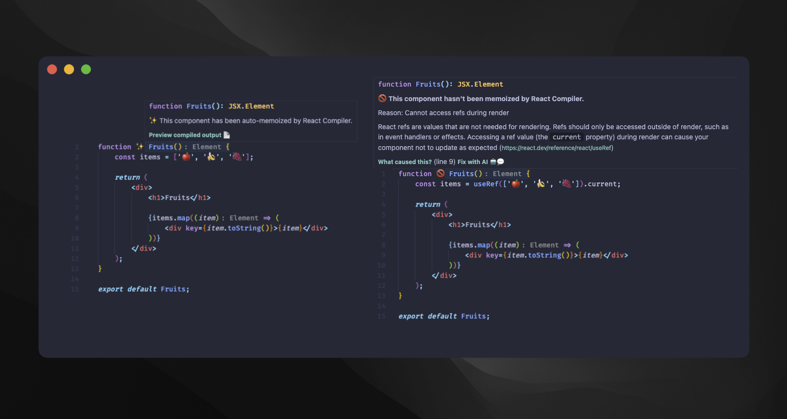

# React Compiler Marker ✨

Highlights components optimized by the React Compiler with visual indicators directly in your editor.



## Features

- **Visual Markers**: See which components are successfully optimized (✨) or failed to compile (🚫)
- **Inline Diagnostics**: Get detailed information about compilation results
- **Preview Output**: View the compiled code generated by React Compiler
- **Real-time Feedback**: Automatic updates as you edit your code

## Configuration

| Setting | Default | Description |
|---------|---------|-------------|
| `reactCompilerMarker.babelPluginPath` | `node_modules/babel-plugin-react-compiler` | Path to babel-plugin-react-compiler in your project |
| `reactCompilerMarker.successEmoji` | `✨` | Marker for successfully optimized components |
| `reactCompilerMarker.errorEmoji` | `🚫` | Marker for components that failed to compile |

## Requirements

Install `babel-plugin-react-compiler` in your project:

```bash
npm install babel-plugin-react-compiler
```

## Commands

- **Activate Extension**: Enable the marker
- **Deactivate Extension**: Disable the marker
- **Check in the current file**: Run compilation check on active file
- **Preview Compiled Output**: View the React Compiler's output code

---

**Tip**: Customize the emoji markers in settings to match your preferences!
